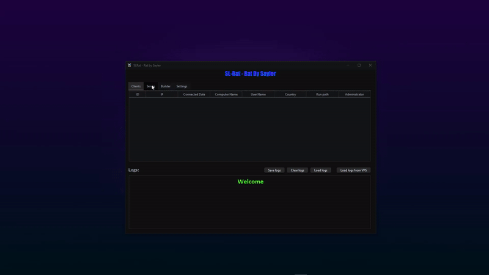
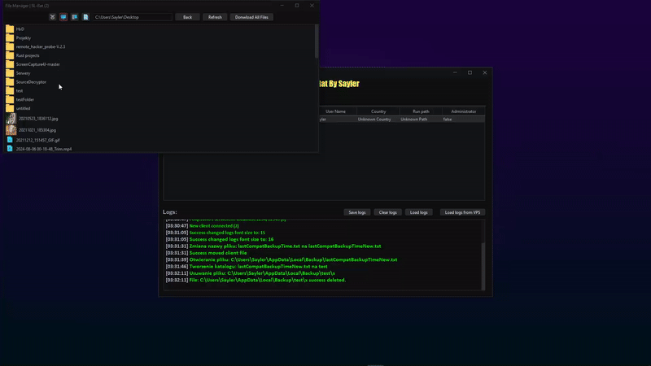
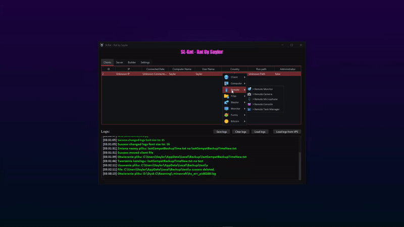
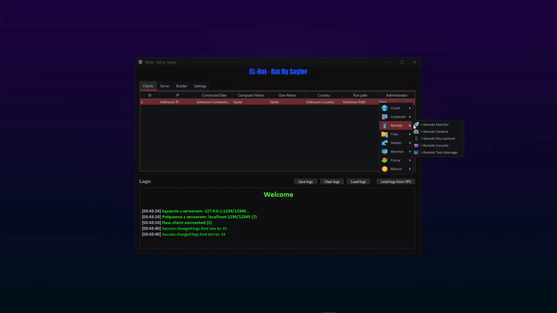
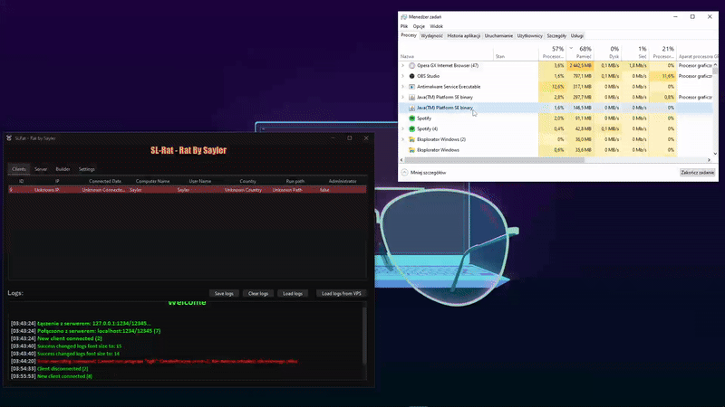

<br/>
<div align="center">
<a href="https://github.com/Saylerr/SL-Rat-Public">

</a>
<h3 align="center">SL-Rat</h3>
<p align="center">
An awesome Remote Access Control
<br/>
<a href="https://youtu.be/pFhtW7ychvM">View Demo.</a>  
</p>
</div>


## About The Project


This is a Remote Access Control.

This software is designed for fun and experimentation purposes. It is important to note that this project should not be used for any malicious or illegal activities. Utilizing this software for unethical purposes is both illegal and immoral.

The project has been developed from scratch by me, with the intention of exploring and learning more about programming.


# Instruction

### VPS-Server
1. Upload `VPSServer` into VPS/Hosting
2. Run command with `VPSServer` file directory:
  ```java
  java -jar VPS-Server.jar -tcp <tcp_port> -udp <udp_port>
  ```
3. follow `Server` instruction

### Server
1. Download `Server.jar`
2. Run file
3. Go to `Server` option
4. write `VPSServer` data. 
5. Click `Connect`.


# Options
### 👨‍🦽 Client
- Chat
- Disconnect
- Reconnect 

### 💻 Computer
- Disable Computer
- Hibernate Computer

### 🩺 Remote
- Remote Desktop 
    - Mouse Click
    - Mouse Move
    - Send keys
- Remote Camera
- Remote Microphone
- Remote PowerShell
- Remote Task Manager

### 🎁 Files
- Disk Filler
- File Manager
    - Run File
    - Run File as Jar
    - Move File
    - Rename File
    - Upload File
    - Download File
    - Download File from URL
    - Download Files from directory
    - Delete file
    - Hide file
    - Show file
    - Create directory
- Ransomware
    - Set encrypted files to custom image
    - Set custom extension
  
### 📦 Stealer
- **BROWSERS**
    - Logins
    - Cookies
    - Credit Cards
    - History
  
- **COMPUTER**
    - Computer Info
    - Screenshot
  
- **INTERNET**
    - IP
    - Location
    - Country
    - Region

- **STEAM**
    - SSFN Files (session files)

- **OTHER**
    - Discord Tokens
    - Camera image
    - Minecraft Accounts
  
### 🎬 Monitor
- Freeze/Unfreeze Monitor
- Disable/Enable Monitor

### 🤣 Funny
- Dancing image
- Random Keywords

### ❓ Other
- Anti-Disabler
- Auto-Startup (Without Admin)

# 🎥 Review
- ### File manager

- ### Remote Desktop && Camera

- ### Remote PowerShell && Task Manager

- ### Auto-Startup

- ### Anti-Disabler


# To-Do List:
#### 👨‍🦽 Client
- Remove RAT
- Run As Administrator

#### 💻 Computer
- Block/UnBlock input
- Disable/Enable Device

#### 🎹 Keyboard
- Keylogger

#### 🩺 Remote
- Remote Stereo Audio
- Remote Virtual Monitor

#### 🤣 Funny
- Reversed Mouse
- Play Audio
- Papiez1337
- Fake Sex
- Web page spammer
- Replace PNG files | Random change

## Contact

If you have any questions or suggestions, feel free to reach out to us:
- Connect with us on Discord: [.sayler](https://discord.com/users/448834616636211200)
